# Template Transformation Pipeline

## Basic Prompt Templates

💡 Concept:
Basic templates are the simplest form - a string with placeholders like {variable} that get replaced with actual values.

## Chat Templates - Conversation Flow

💡 Concept:
Chat templates structure conversations with different message types: system (instructions), human (user), and assistant (AI) messages.

🎭 Message Flow Animation:
**SYSTEM**: You are a {role} expert.
**HUMAN**: Explain {concept} to me.
**ASSISTANT**: I'll explain {concept} as a {role} expert.

## Few-Shot Templates - Learn by Example

💡 Concept:
Few-shot templates teach the AI by showing examples. The AI learns the pattern from examples and applies it to new inputs.

## Advanced Templates - Production Ready

💡 Concept:
Advanced features include validation, partial variables, output parsers, and conditional logic for production applications.

## **Caputured Output**

## Model Connection Pipeline

### Your First Model - Getting Started with ChatOpenAI

💡 Concept:
ChatOpenAI connects to OpenAI-compatible APIs. With our proxy server, you can access multiple models through one interface!

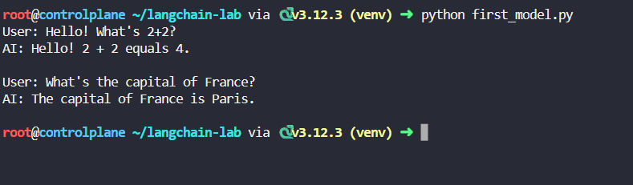

### Talking to Models - Messages System

💡 Concept:
Models understand structured conversations through messages: System (instructions), Human (user), and AI (assistant) messages.

🎭 Message Flow:
SYSTEM: You are a helpful assistant
HUMAN: What's your name?
AI: I'm your AI assistant!

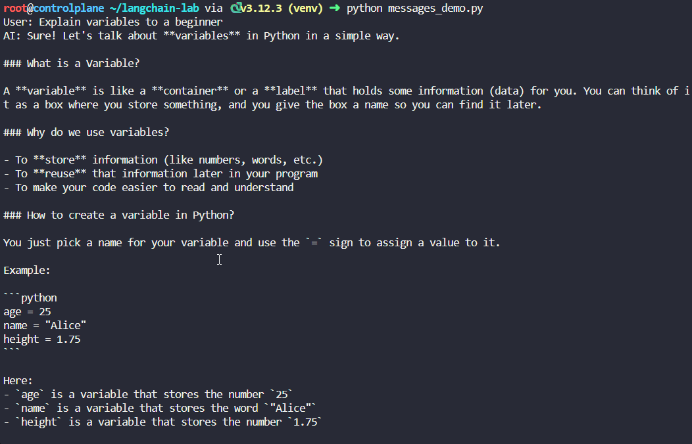

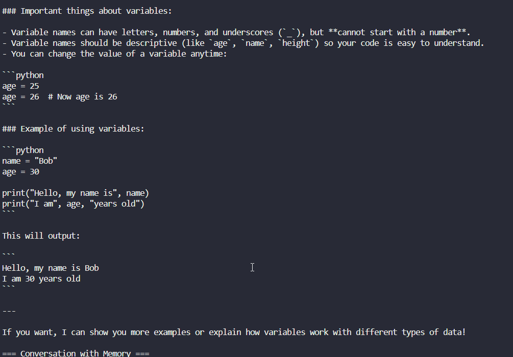

### Model Configuration - Fine-tuning Behavior

💡 Concept:
Control your model's behavior with temperature: 0 = precise & consistent, 1 = creative & varied.

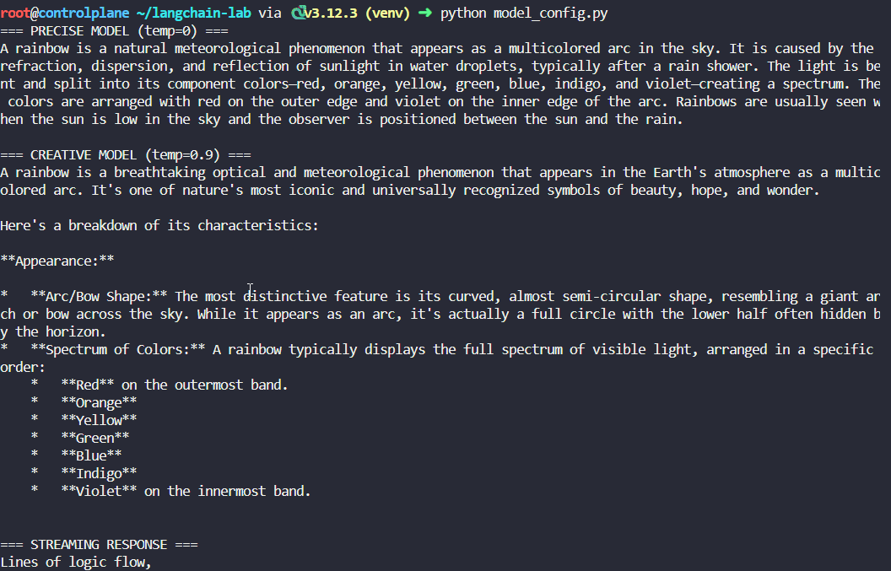

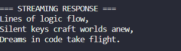

### Multiple Models - The Right Tool for Each Job

💡 Concept:
Different models excel at different tasks. Choose the right model for speed, cost, or capability!

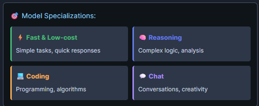

## LCEL - Master the LangChain Expression Language

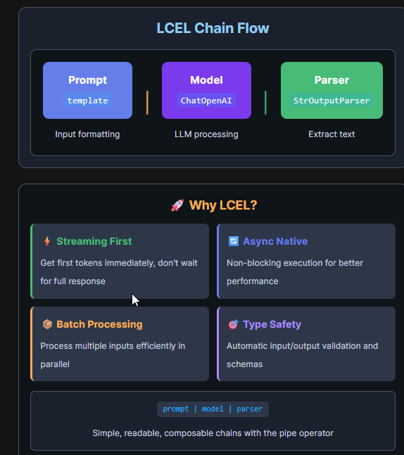

### Sequential Chains - The Pipeline Pattern

💡 Concept:
LCEL uses the pipe operator | to chain components. Data flows left to right: input → prompt → model → parser → output.

### Parallel Execution - RunnableParallel for Speed

💡 Concept:
RunnableParallel executes multiple chains concurrently, reducing latency. Perfect for independent operations like generating multiple responses or calling different models simultaneously.

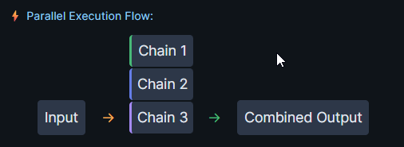

### Dynamic Routing - RunnableLambda & Conditional Logic

💡 Concept:
RunnableLambda allows custom Python functions in chains. Use it for data transformation, conditional routing, or any custom logic between chain steps.

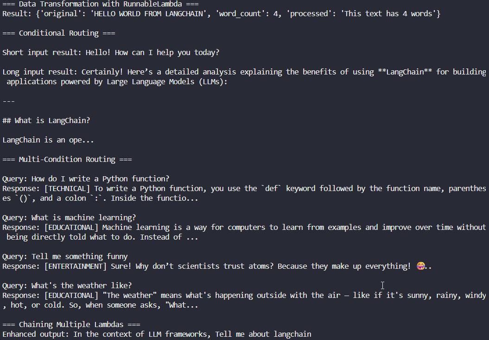

### Advanced LCEL - Streaming, Batch & Error Handling

💡 Concept:
LCEL provides built-in support for streaming (get tokens as they arrive), batch processing (handle multiple inputs efficiently), and fallback chains for error handling.

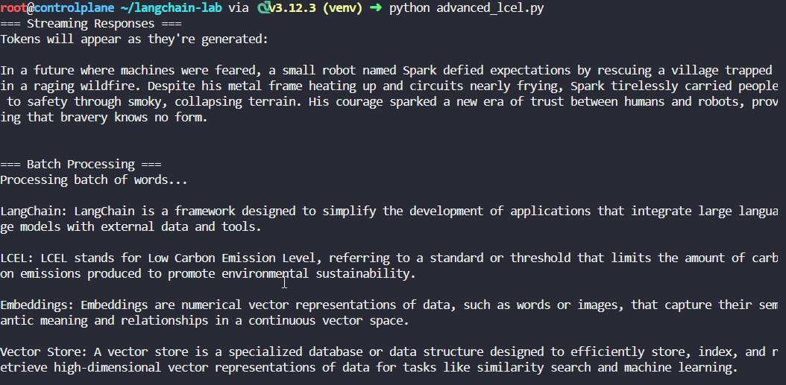

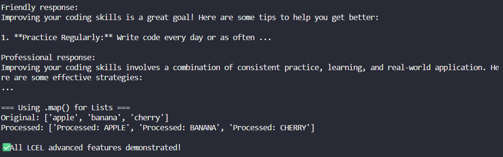

## Memory Systems - Master Conversational Context

### Memory Fundamentals - Building Conversational Context

📊 How Buffer Memory Works:
Messages in Buffer:
[1] "Hi, I'm Alice" ← stored
[2] "I like Python" ← stored
[3] "What's my name?" ← stored
→ AI recalls: "You're Alice and you like Python"

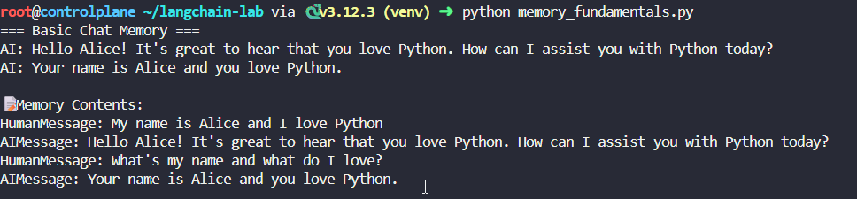

### Advanced Memory Types - Smart Context Management

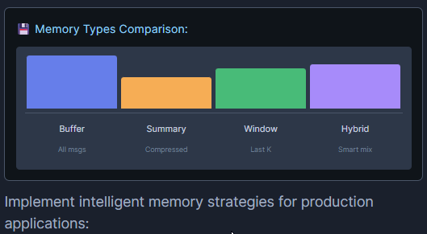

