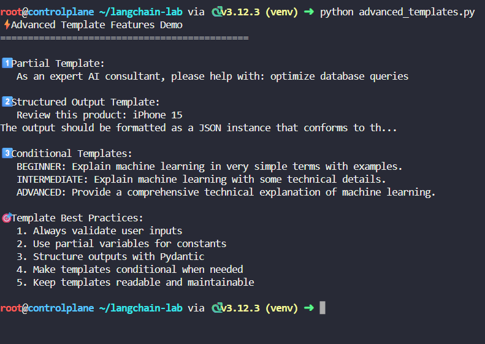

# Template Transformation Pipeline

## Basic Prompt Templates

💡 Concept:
Basic templates are the simplest form - a string with placeholders like {variable} that get replaced with actual values.

## Chat Templates - Conversation Flow

💡 Concept:
Chat templates structure conversations with different message types: system (instructions), human (user), and assistant (AI) messages.

🎭 Message Flow Animation:
**SYSTEM**: You are a {role} expert.
**HUMAN**: Explain {concept} to me.
**ASSISTANT**: I'll explain {concept} as a {role} expert.

## Few-Shot Templates - Learn by Example

💡 Concept:
Few-shot templates teach the AI by showing examples. The AI learns the pattern from examples and applies it to new inputs.

## Advanced Templates - Production Ready

💡 Concept:
Advanced features include validation, partial variables, output parsers, and conditional logic for production applications.

## **Caputured Output**

