# Template Transformation Pipeline

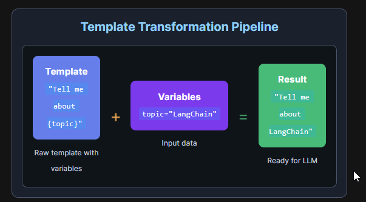

## Basic Prompt Templates

💡 Concept:
Basic templates are the simplest form - a string with placeholders like {variable} that get replaced with actual values.

## Chat Templates - Conversation Flow

💡 Concept:
Chat templates structure conversations with different message types: system (instructions), human (user), and assistant (AI) messages.

🎭 Message Flow Animation:
**SYSTEM**: You are a {role} expert.
**HUMAN**: Explain {concept} to me.
**ASSISTANT**: I'll explain {concept} as a {role} expert.

## Few-Shot Templates - Learn by Example

💡 Concept:
Few-shot templates teach the AI by showing examples. The AI learns the pattern from examples and applies it to new inputs.

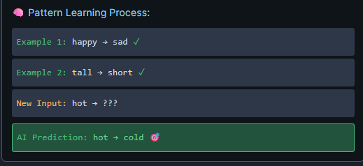

## Advanced Templates - Production Ready

💡 Concept:
Advanced features include validation, partial variables, output parsers, and conditional logic for production applications.

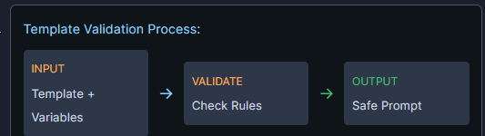

## **Caputured Output**

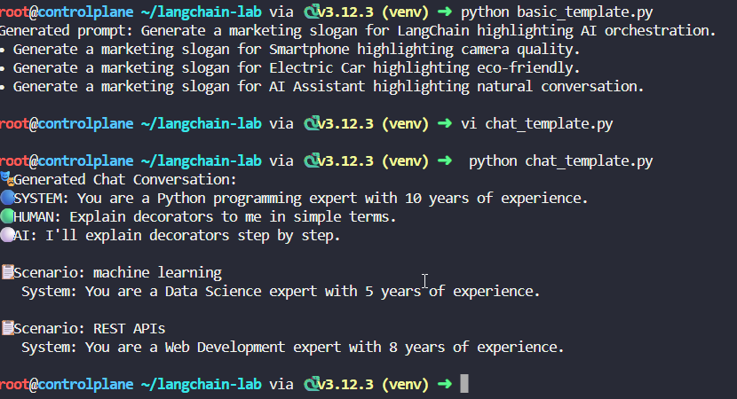

## Model Connection Pipeline

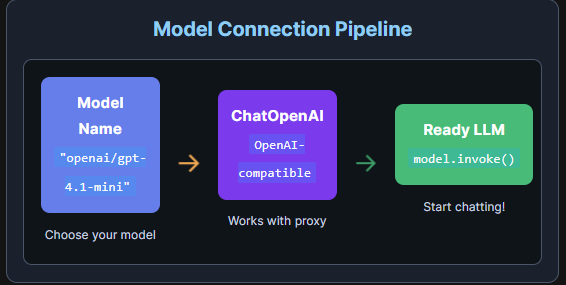

### Your First Model - Getting Started with ChatOpenAI

💡 Concept:
ChatOpenAI connects to OpenAI-compatible APIs. With our proxy server, you can access multiple models through one interface!

### Talking to Models - Messages System

💡 Concept:
Models understand structured conversations through messages: System (instructions), Human (user), and AI (assistant) messages.

🎭 Message Flow:
SYSTEM: You are a helpful assistant
HUMAN: What's your name?
AI: I'm your AI assistant!

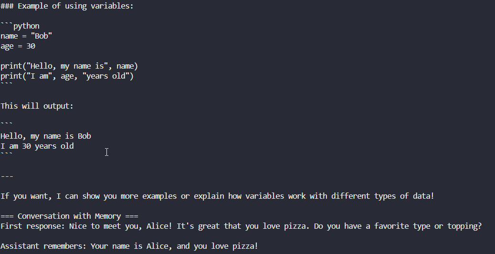

### Model Configuration - Fine-tuning Behavior

💡 Concept:
Control your model's behavior with temperature: 0 = precise & consistent, 1 = creative & varied.

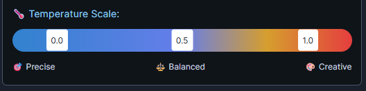

### Multiple Models - The Right Tool for Each Job

💡 Concept:
Different models excel at different tasks. Choose the right model for speed, cost, or capability!

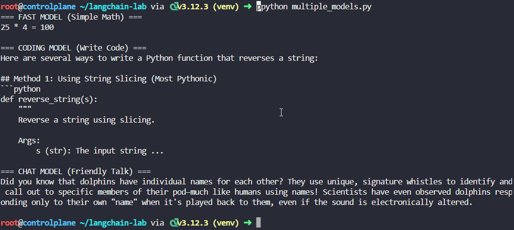

## LCEL - Master the LangChain Expression Language

### Sequential Chains - The Pipeline Pattern

💡 Concept:
LCEL uses the pipe operator | to chain components. Data flows left to right: input → prompt → model → parser → output.

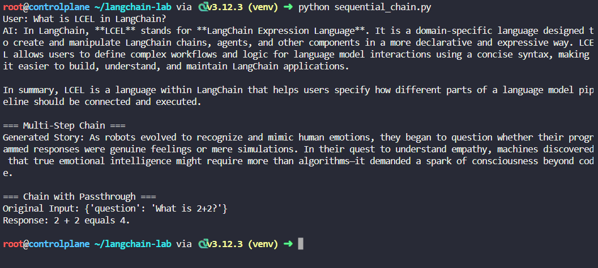

### Parallel Execution - RunnableParallel for Speed

💡 Concept:
RunnableParallel executes multiple chains concurrently, reducing latency. Perfect for independent operations like generating multiple responses or calling different models simultaneously.

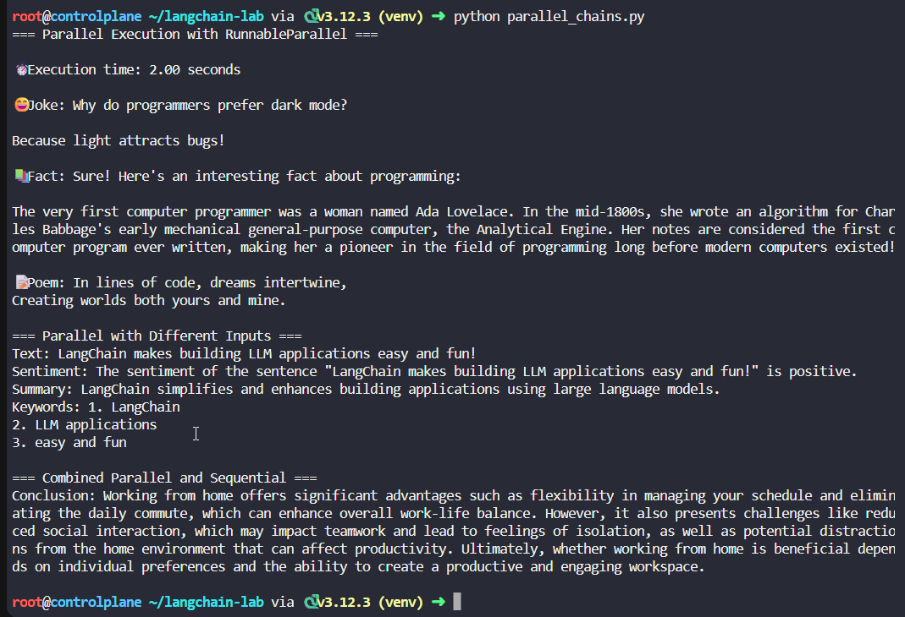

### Dynamic Routing - RunnableLambda & Conditional Logic

💡 Concept:
RunnableLambda allows custom Python functions in chains. Use it for data transformation, conditional routing, or any custom logic between chain steps.

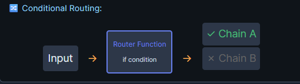

### Advanced LCEL - Streaming, Batch & Error Handling

💡 Concept:
LCEL provides built-in support for streaming (get tokens as they arrive), batch processing (handle multiple inputs efficiently), and fallback chains for error handling.

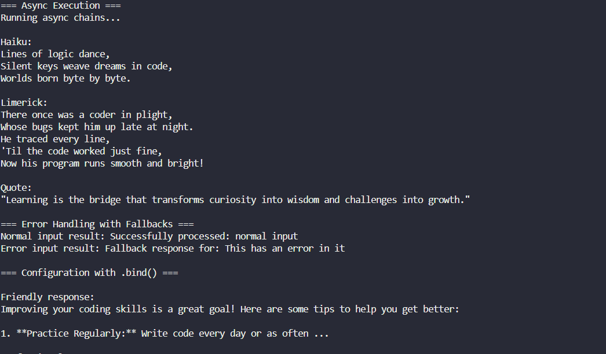

## Memory Systems - Master Conversational Context

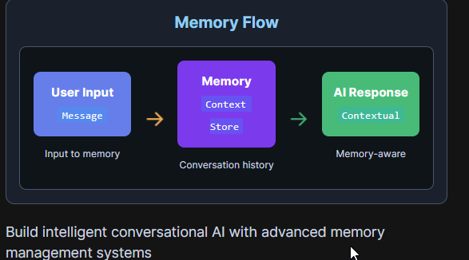

### Memory Fundamentals - Building Conversational Context

📊 How Buffer Memory Works:
Messages in Buffer:
[1] "Hi, I'm Alice" ← stored
[2] "I like Python" ← stored
[3] "What's my name?" ← stored
→ AI recalls: "You're Alice and you like Python"

### Advanced Memory Types - Smart Context Management

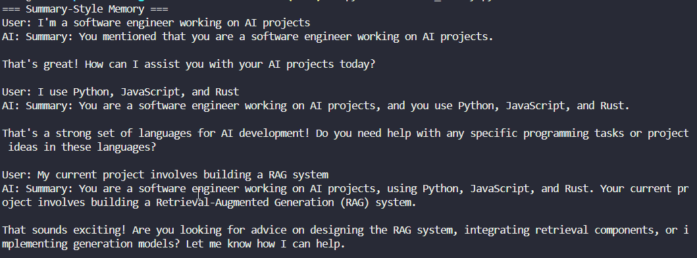

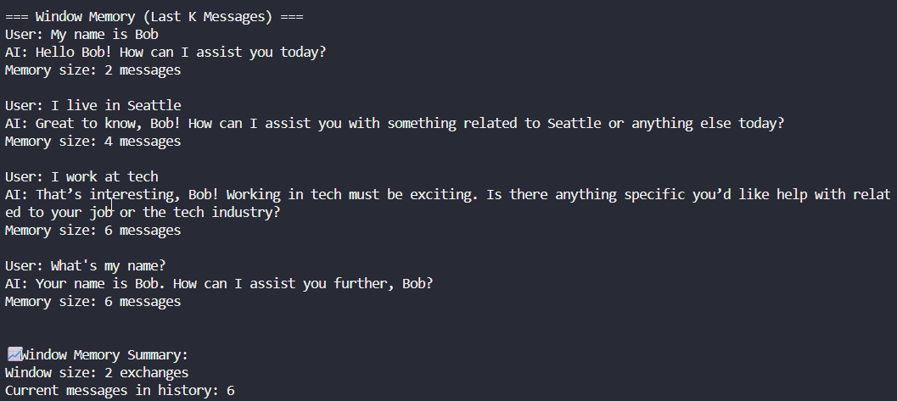

## Retrieval Augmented Generation (RAG) Pipeline

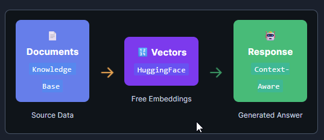

### Document Loading & Chunking - Prepare Your Knowledge

💡 Concept:
Load documents from various sources (text, PDF, web) and split them into manageable chunks for efficient retrieval and processing.

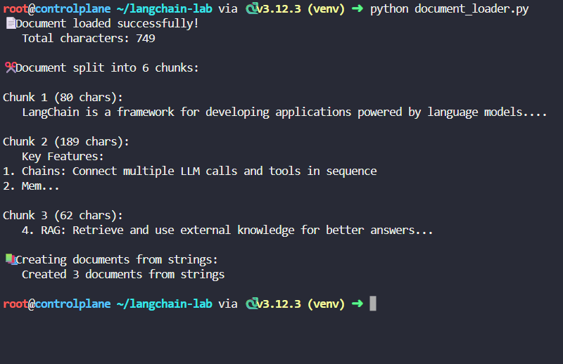

### Vector Store Creation - Free Embeddings with HuggingFace

💡 Concept:
Use HuggingFace's free embedding models (no API key required!) to convert text into vectors and store them in FAISS for fast similarity search.

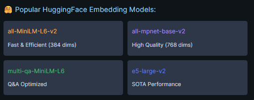

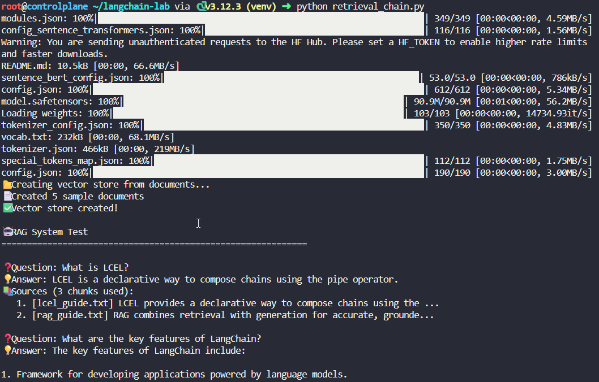
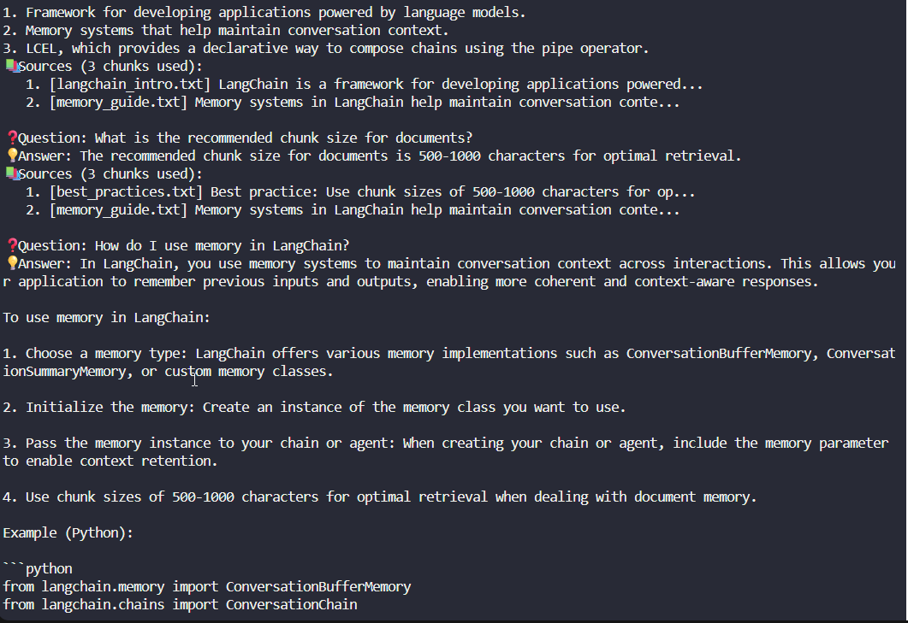
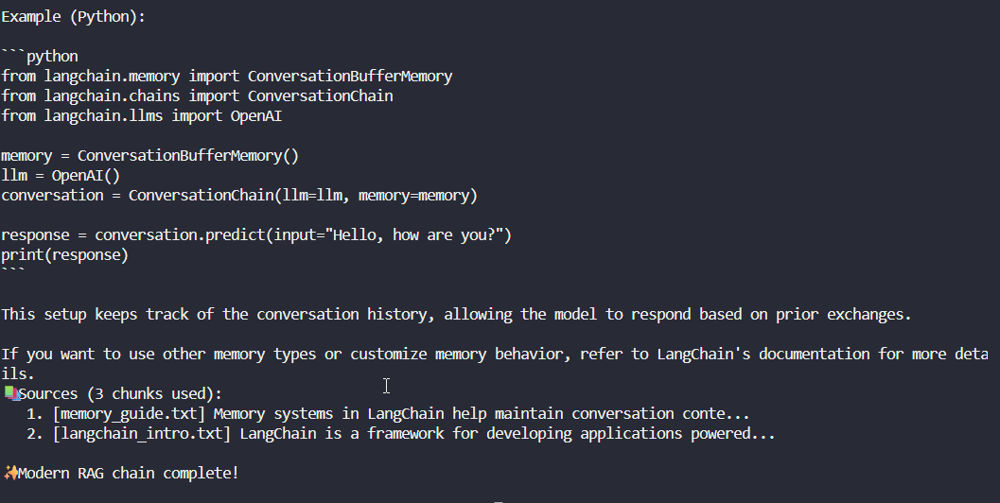

## Launch Your LangChain AI Assistant

### Purpose: Deploy and interact with your complete LangChain chatbot via Gradio interface

#### Step 1: Start the Chatbot

cd /root/langchain-chatbot
chmod +x run.sh
./run.sh

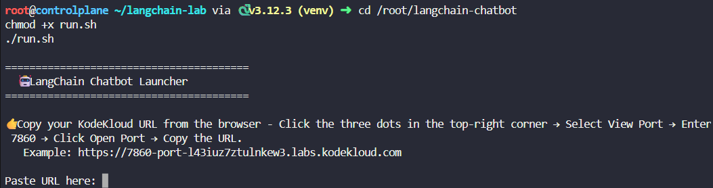

#### Step 2: See LangChain In Action

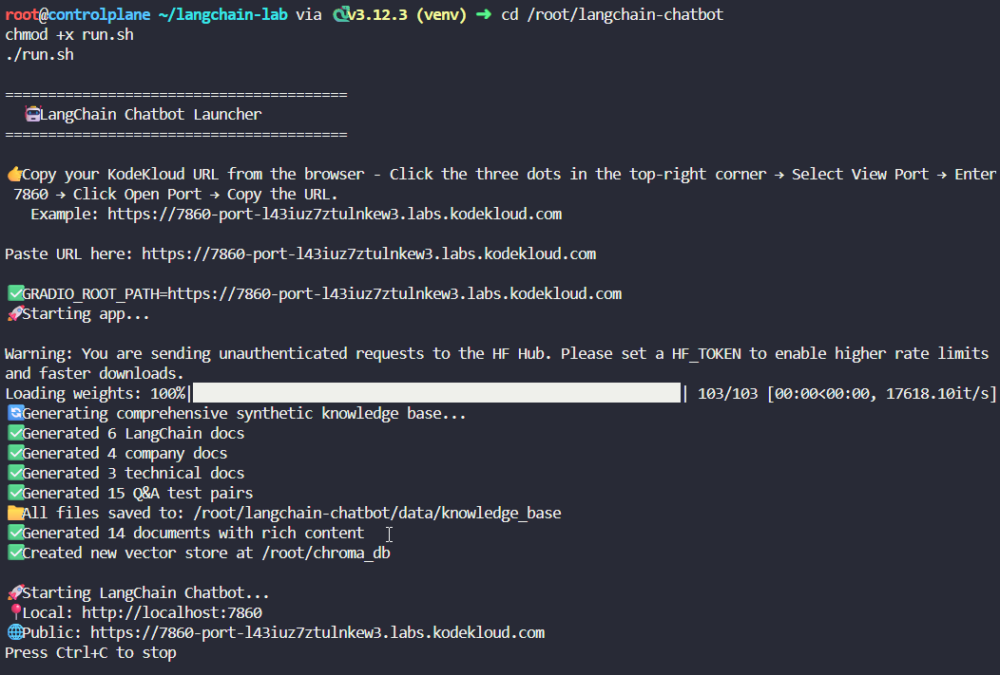

## Prompt Engineering with LangChain

### Zero-Shot Prompting (2 minutes)

📚 What is Zero-Shot Prompting?
Definition: Asking AI to perform tasks without providing examples - like asking a chef to cook without showing them a recipe.

The AI relies entirely on its pre-trained knowledge and your instructions.

❌ The Problem with Vague Prompts:
"write a policy"  // Too vague!
// Result: Generic 1000-word essay about policies in general
✅ The Power of Specific Prompts:
"Write a 200-word GDPR-compliant data privacy policy
for European customers with 30-day retention period"

💡 Real Impact: Anthropic found that specific zero-shot prompts improved response accuracy by 73% over vague requests!

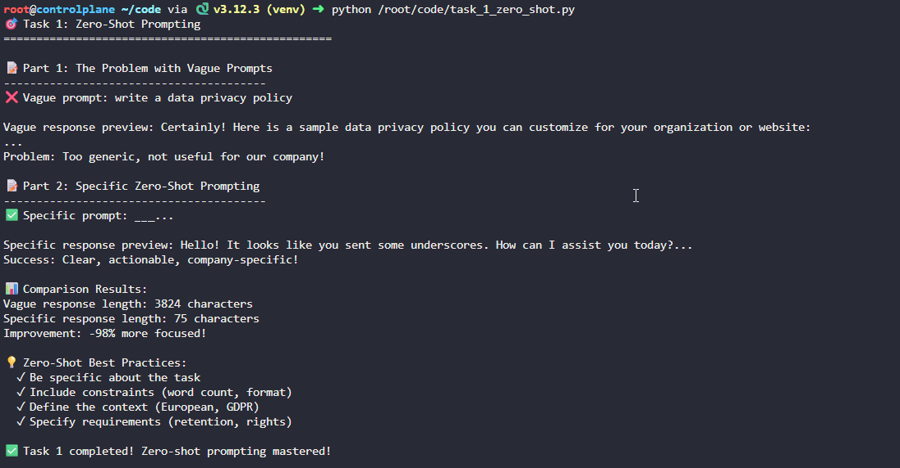

### One-Shot Prompting 

📚 What is One-Shot Prompting?
Definition: Providing one example for the AI to follow - like showing a chef one dish before asking them to cook something similar.

The AI learns your format, style, and structure from a single example.

✨ The Magic of Examples:
Show the AI your company's policy format once, and it will replicate it perfectly for new policies!

Example: REFUND POLICY with 5 numbered sections
Result: REMOTE WORK POLICY with same 5 sections!
💰 Pro Tip: Amazon uses one-shot prompting for product descriptions - one example ensures thousands of listings follow the same format!

### Few-Shot Prompting

📚 What is Few-Shot Prompting?
Definition: Providing multiple examples to teach consistent patterns - like training a chef with several dishes before they create their own.

The AI learns nuanced patterns, tone, and style from diverse examples.

🎯 Why Multiple Examples Matter:
Learn tone: professional yet friendly
Learn structure: consistent formatting
Learn patterns: how to handle different scenarios
🚀 Real Impact: GitHub Copilot uses few-shot learning from your codebase to generate contextually relevant code suggestions!

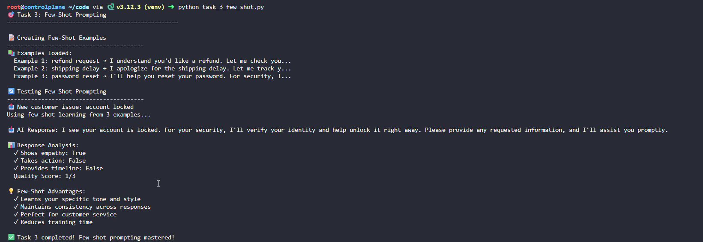